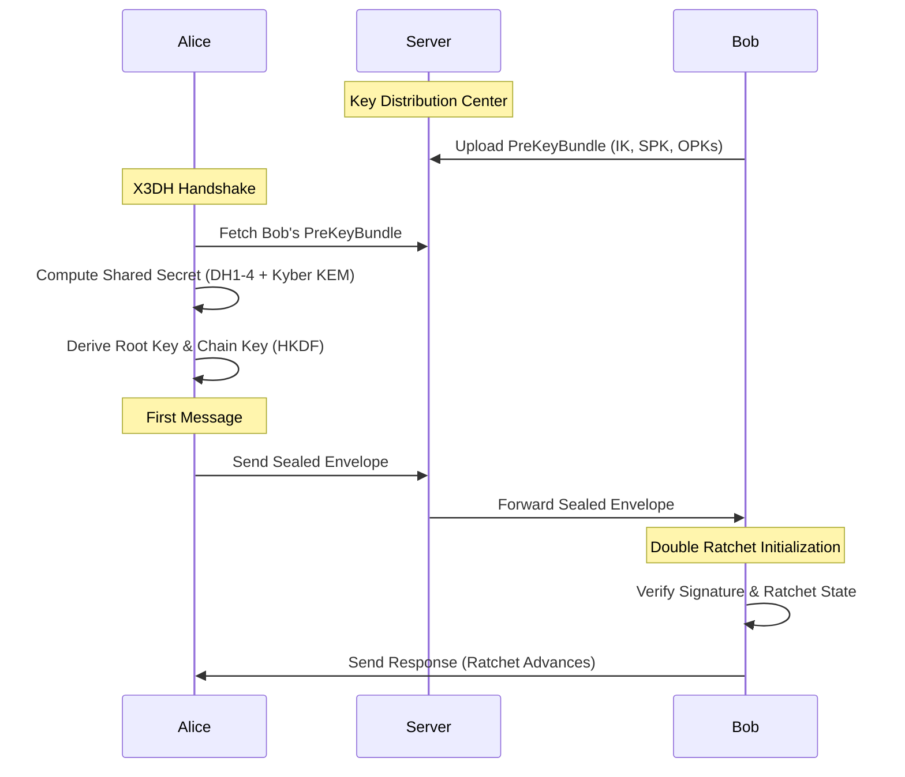

<div align="center">
  <h1>Sibna Protocol</h1>
  <p><i>A Production-Grade X3DH & Double Ratchet Implementation in Rust</i></p>
  
  [](https://crates.io/crates/sibna_core)
  [](#license)
  [](https://github.com/SibnaOfficial/sibna-protc/actions)
  [](#security)
</div>

---

**Sibna** is an advanced, standalone cryptographic library providing robust end-to-end encryption (E2EE) primitives. It implements industry-standard protocols—combining the **X3DH (Extended Triple Diffie-Hellman)** key agreement with the secure **Double Ratchet** algorithm—designed for integration into commercial and open-source communication platforms.

## 🌟 Core Capabilities

- **Perfect Forward Secrecy & Post-Compromise Security**: Sessions are continuously renewed. Compromised keys in the present cannot decrypt the past or the future.
- **Quantum-Resistant Hybrid Architecture**: Integrates `ML-KEM-768` (FIPS 203 Kyber) alongside classical `X25519` for future-proofed key exchanges.
- **Metadata Protection Layer**: Enforces fixed-block message padding (preventing length analysis) and integrates Poisson-distributed cover traffic.
- **Sealed Sender Envelopes**: The server relays zero-knowledge envelopes, authenticating the payload without knowing the sender's identity.
- **Universal Transports**: Seamlessly route over **P2P direct connections**, **WebSocket Relays**, and **Tor/SOCKS5** anonymity proxies.

---

## 🏗️ Architecture

The library is designed symmetrically for both peer-to-peer and relayed architectures. 



---

## 📦 Installation & Setup

Add `sibna_core` to your `Cargo.toml`:

```toml
[dependencies]
sibna_core = { version = "1.0.4", features = ["pqc", "relay"] }
```

### Quick E2EE Communication Example

```rust
use sibna_core::{SecureContext, Config};
use sibna_core::crypto::{CryptoHandler, KeyGenerator};

#[tokio::main]
async fn main() -> Result<(), Box<dyn std::error::Error>> {
    // 1. Initialize Context with a secure backend
    let config = Config::default();
    let ctx = SecureContext::new(config, Some(b"StrongPassword!"))?;

    // 2. Cryptographic Handler Generation
    let session_key = KeyGenerator::generate_key()?;
    let handler = CryptoHandler::new(session_key.as_ref())?;

    // 3. Encrypting Payload (ChaCha20-Poly1305)
    let aad = b"header_data";
    let ciphertext = handler.encrypt(b"System critical payload", aad)?;

    // 4. Decrypting & Authenticating
    let plaintext = handler.decrypt(&ciphertext, aad)?;
    assert_eq!(plaintext, b"System critical payload");

    Ok(())
}
```

---

## 🛡️ Security Posture

Sibna adopts a deeply defensive approach to memory layout and input sanitization:
1. All private key materials trigger standard `zeroize` sweeps on drop.
2. Non-constant-time comparators are rigorously avoided via the `subtle` crate.
3. Cryptographic validations ensure absolute strictness over key sizes & mathematical bounds.

> **Note on Zero-Knowledge Limits:** Sibna relies heavily on the `Server` infrastructure being trusted for **routing** but untrusted for **payload inspection**. For full threat-model disclosures, refer to the [SECURITY.md](SECURITY.md) guidelines.

---

## 📘 Companion Documentation

- [Protocol Specification](PROTOCOL_SPECIFICATION.md): Deep dive into our X3DH equations, KD functions, and Envelope schemas.
- [Security Model](SECURITY.md): Granular breakdown of our threat definitions, structural bounds, and responsible disclosure policy.
- [Changelog](CHANGELOG.md): Historical patches and version definitions.

## ⚖️ License

Dual-licensed under **Apache License 2.0** or **MIT License** at your discretion. See the [LICENSE](LICENSE) file for complete details.
